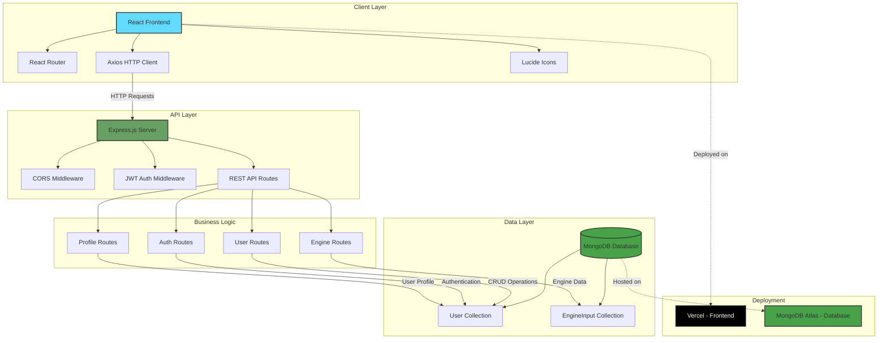

# 🌱 EngineEx - Vehicle Pollution Awareness & Engine Upgrade Platform

<div align="center">


**A modern full-stack web platform dedicated to controlling pollution by spreading awareness about vehicle engine health and promoting eco-friendly engine upgrades.**

[🚀 Live Demo](https://heavy-vehicles.vercel.app/) • [📖 Documentation](#-features) • [🐛 Report Bug](https://github.com/Annu881/EngineEx1/issues)

</div>

---

## 📑 Table of Contents

- [🎯 Overview](#-overview)
- [🏗️ System Architecture](#️-system-architecture)
- [✨ Features](#-features)
- [🛠️ Tech Stack](#️-tech-stack)
- [📡 API Documentation](#-api-documentation)
- [🚀 Live Deployment](#-live-deployment)
- [📦 Getting Started](#-getting-started)
- [📂 Project Structure](#-project-structure)
- [🌍 Environmental Impact](#-environmental-impact)
- [🤝 Contributing](#-contributing)
- [📄 License](#-license)

---

## 🎯 Overview

**EngineEx** is a comprehensive environmental awareness platform that educates vehicle owners about the critical importance of engine health and its direct impact on air pollution. The platform provides detailed information about government initiatives, eco-friendly engine upgrade options, and practical steps to reduce vehicular emissions.

### Mission

To combat air pollution by empowering vehicle owners with knowledge and resources to maintain cleaner, more efficient engines, ultimately contributing to a healthier environment and sustainable future.

### Key Highlights

- 🌿 **Pollution Awareness** - Educational content about vehicle emissions and environmental impact
- 🔧 **Engine Upgrade Recommendations** - Smart engine matching system for eco-friendly upgrades
- 🏛️ **Government Schemes** - Comprehensive details about FAME II, Scrappage Policy, PLI Scheme
- 📊 **User Dashboard** - Personalized tracking and engine health recommendations
- 🔐 **Secure Authentication** - JWT-based user registration and login system
- 🚗 **Service Center Locator** - Find nearby service centers for engine upgrades

---

## 🏗️ System Architecture

### High-Level Design Diagram



### Architecture Overview

**EngineEx** follows a modern **3-tier architecture**:

1. **Presentation Layer (Frontend)**
   - Built with React 19.1 for a responsive, component-based UI
   - React Router for seamless client-side navigation
   - Axios for efficient API communication
   - Lucide React for modern iconography

2. **Application Layer (Backend)**
   - Express.js server handling REST API requests
   - JWT-based authentication for secure user sessions
   - CORS enabled for cross-origin requests
   - Modular route structure for maintainability

3. **Data Layer (Database)**
   - MongoDB for flexible, document-based storage
   - Mongoose ODM for schema validation
   - Collections: Users, EngineInput

---

## ✨ Features

### 🌱 Environmental Education
- Comprehensive information about vehicle pollution and its environmental impact
- Benefits of upgrading to BS-VI compliant and eco-friendly engines
- Best practices for engine maintenance to reduce harmful emissions
- Interactive learning experience with government scheme details

### 🏛️ Government Initiatives
- **FAME II Scheme** - Faster Adoption and Manufacturing of Electric Vehicles
- **Scrappage Policy** - Financial incentives for replacing old, polluting vehicles
- **PLI Scheme** - Production Linked Incentive for automotive manufacturing sector
- **State EV Schemes** - Regional electric vehicle adoption programs and subsidies

### 🔧 Smart Engine Recommendation System
- Input your current engine specifications
- Get personalized upgrade recommendations
- Compare BS-III/IV to BS-VI engine options
- Cost estimates for engine upgrades
- Support for multiple fuel types: Diesel, CNG, Electric, Hybrid

### 👤 User Features
- **User Registration** - Secure account creation with email validation
- **Authentication** - JWT-based login system
- **Personalized Dashboard** - Track your engine upgrade journey
- **Profile Management** - Update user information
- **Engine History** - View past engine queries and recommendations

### 📱 User Experience
- Fully responsive design for desktop, tablet, and mobile devices
- Clean and intuitive interface with modern UI/UX
- Fast loading times with optimized performance
- Interactive navigation with smooth transitions

---

## 🛠️ Tech Stack

### Frontend
| Technology | Purpose | Version |
|------------|---------|---------|
| [React](https://react.dev/) | UI Framework | 19.1.0 |
| [React Router DOM](https://reactrouter.com/) | Client-side Routing | 7.6.1 |
| [Axios](https://axios-http.com/) | HTTP Client | 1.9.0 |
| [Lucide React](https://lucide.dev/) | Icon Library | 0.511.0 |
| [JavaScript](https://developer.mozilla.org/en-US/docs/Web/JavaScript) | Programming Language | ES6+ |
| [HTML5](https://developer.mozilla.org/en-US/docs/Web/HTML) | Markup | 5 |
| [CSS3](https://developer.mozilla.org/en-US/docs/Web/CSS) | Styling | 3 |

### Backend
| Technology | Purpose | Version |
|------------|---------|---------|
| [Node.js](https://nodejs.org/) | Runtime Environment | Latest |
| [Express.js](https://expressjs.com/) | Web Framework | 5.1.0 |
| [MongoDB](https://www.mongodb.com/) | NoSQL Database | Latest |
| [Mongoose](https://mongoosejs.com/) | ODM | 8.15.0 |
| [JWT](https://jwt.io/) | Authentication | 9.0.2 |
| [Bcrypt](https://www.npmjs.com/package/bcrypt) | Password Hashing | 6.0.0 |
| [Joi](https://joi.dev/) | Validation | 17.13.3 |
| [CORS](https://www.npmjs.com/package/cors) | Cross-Origin Resource Sharing | 2.8.5 |
| [Dotenv](https://www.npmjs.com/package/dotenv) | Environment Variables | 16.5.0 |

### Development Tools
| Tool | Purpose |
|------|---------|
| [Nodemon](https://nodemon.io/) | Auto-restart server |
| [React Scripts](https://create-react-app.dev/) | Build tooling |

### Deployment
| Service | Platform | URL |
|---------|----------|-----|
| Frontend | [Vercel](https://vercel.com) | https://heavy-vehicles.vercel.app/ |
| Database | [MongoDB Atlas](https://www.mongodb.com/cloud/atlas) | Cloud-hosted |

---

## 📡 API Documentation

### Base URL
```
Production: https://heavy-vehicles.vercel.app/api
Development: http://localhost:8080/api
```

### Authentication Endpoints

#### 1. User Registration
```http
POST /api/users
```

**Request Body:**
```json
{
  "firstName": "John",
  "lastName": "Doe",
  "email": "john.doe@example.com",
  "password": "SecurePassword123!"
}
```

**Response:**
```json
{
  "message": "User created successfully"
}
```

#### 2. User Login
```http
POST /api/auth
```

**Request Body:**
```json
{
  "email": "john.doe@example.com",
  "password": "SecurePassword123!"
}
```

**Response:**
```json
{
  "data": "eyJhbGciOiJIUzI1NiIsInR5cCI6IkpXVCJ9...",
  "message": "Logged in successfully"
}
```

### Engine Endpoints

#### 3. Get Engine Recommendations
```http
POST /api/engine-info
```

**Request Body:**
```json
{
  "EngineNumber": "Cummins ISB6.7",
  "Displacement": "6.7L",
  "Power_Output": "250 hp",
  "Emmision_Norm": "BS-VI",
  "FuelType": "Diesel",
  "userId": "user_id_here"
}
```

**Response:**
```json
{
  "result": [
    {
      "EmissionNorm": "BS-III Diesel",
      "EngineNumber": "Cummins ISB6.7 BS-VI",
      "Power_Output": "200–300 HP",
      "FuelType": "Diesel",
      "ApproximateCost": "₹8–12 Lakhs"
    },
    {
      "EmissionNorm": "BS-IV Diesel",
      "EngineNumber": "Weichai WP7NG BS-VI",
      "Power_Output": "~300 HP",
      "FuelType": "CNG",
      "ApproximateCost": "₹10–14 Lakhs"
    },
    {
      "EmissionNorm": "BS-III/IV Diesel",
      "EngineNumber": "Electric Retrofit Kit",
      "Power_Output": "N/A",
      "FuelType": "Electric",
      "ApproximateCost": "₹15–20 Lakhs"
    }
  ]
}
```

### Profile Endpoints

#### 4. Get User Profile
```http
GET /api/profile/:userId
```

**Headers:**
```
Authorization: Bearer <JWT_TOKEN>
```

**Response:**
```json
{
  "user": {
    "firstName": "John",
    "lastName": "Doe",
    "email": "john.doe@example.com"
  }
}
```

---

## 🚀 Live Deployment

| Service | URL | Status |
|---------|-----|--------|
| **Live Website** | [heavy-vehicles.vercel.app](https://heavy-vehicles.vercel.app/) |  |
| **GitHub Repository** | [github.com/Annu881/EngineEx1](https://github.com/Annu881/EngineEx1) |  |

---

## 📦 Getting Started

### Prerequisites

Before you begin, ensure you have the following installed:
- **Node.js** (v14 or higher)
- **npm** or **yarn**
- **MongoDB** (local installation or MongoDB Atlas account)
- **Git**

### Installation

#### 1️⃣ Clone Repository

```bash
git clone https://github.com/Annu881/EngineEx1.git
cd EngineEx1
```

#### 2️⃣ Install Backend Dependencies

```bash
cd server
npm install
```

#### 3️⃣ Configure Backend Environment

Create a `.env` file in the `server` directory:

```env
# MongoDB Connection
MONGODB_URI=mongodb://localhost:27017/engineex
# OR for MongoDB Atlas:
# MONGODB_URI=mongodb+srv://<username>:<password>@cluster.mongodb.net/engineex

# JWT Secret Key
JWTPRIVATEKEY=your_super_secret_jwt_key_here

# Server Port
PORT=8080
```

#### 4️⃣ Start Backend Server

```bash
npm start
```

Backend runs on: `http://localhost:8080`

#### 5️⃣ Install Frontend Dependencies

Open a new terminal:

```bash
cd client
npm install
```

#### 6️⃣ Configure Frontend Environment

Create a `.env` file in the `client` directory:

```env
REACT_APP_API_URL=http://localhost:8080/api
```

#### 7️⃣ Start Frontend Development Server

```bash
npm start
```

Frontend runs on: `http://localhost:3000`

### Build for Production

#### Backend
```bash
cd server
npm start
```

#### Frontend
```bash
cd client
npm run build
```

The optimized production build will be created in the `client/build` directory.

---

## 📂 Project Structure

```
EngineEx1/
├── client/                    # React Frontend
│   ├── public/               # Static assets
│   ├── src/
│   │   ├── components/       # React components
│   │   │   ├── First/       # Landing page components
│   │   │   ├── Login/       # Login page
│   │   │   ├── Signup/      # Registration page
│   │   │   ├── Main/        # Dashboard
│   │   │   ├── Form/        # Engine input form
│   │   │   ├── Service/     # Service center locator
│   │   │   └── UserProfile/ # User profile management
│   │   ├── App.js           # Main app component with routing
│   │   ├── index.js         # React entry point
│   │   └── index.css        # Global styles
│   ├── package.json         # Frontend dependencies
│   └── README.md            # Frontend documentation
│
├── server/                   # Node.js Backend
│   ├── models/              # Mongoose schemas
│   │   ├── user.js         # User model
│   │   └── EngineInput.js  # Engine data model
│   ├── routes/             # API routes
│   │   ├── auth.js        # Authentication routes
│   │   ├── users.js       # User registration
│   │   ├── engine.js      # Engine recommendation logic
│   │   └── profile.js     # User profile routes
│   ├── db.js              # MongoDB connection
│   ├── index.js           # Server entry point
│   ├── package.json       # Backend dependencies
│   └── .env               # Environment variables
│
├── package.json            # Root package.json
└── README.md              # This file
```

---

## 🌍 Environmental Impact

### Why Engine Health Matters

- **Reduced Emissions**: Well-maintained engines emit up to **50% less pollutants**
- **Fuel Efficiency**: Proper engine care improves fuel economy by **10-20%**
- **Air Quality**: Collective action can significantly improve urban air quality
- **Climate Change**: Lower emissions contribute to fighting global warming
- **Health Benefits**: Reduced air pollution leads to better public health outcomes

### Supported Engine Upgrades

EngineEx provides recommendations for upgrading from:

#### Heavy-Duty Engines
- **Cummins ISB6.7** (6.7L, 200-300 HP)
- **Volvo D13K** (13L, 420-540 HP)
- **Mercedes-Benz OM 457** (12L, 360-428 HP)
- **Cummins ISX15** (14.9L, 400-600 HP)
- **Detroit Diesel DD15** (14.8L, 400-505 HP)

#### Upgrade Options
- **BS-VI Diesel Engines** - Latest emission standards
- **CNG Conversions** - Cleaner fuel alternative
- **Electric Retrofit Kits** - Zero-emission solution
- **Hybrid Systems** - Combined diesel/electric power

### Government Support

The Indian government offers various incentives for:

- ✅ Scrapping old, polluting vehicles (up to ₹5 Lakhs)
- ✅ Adopting electric vehicles (FAME II subsidies)
- ✅ Upgrading to BS-VI compliant engines
- ✅ Installing emission control devices

---

## 🤝 Contributing

Contributions are welcome! Please follow these steps:

1. **Fork the repository**
   ```bash
   git clone https://github.com/Annu881/EngineEx1.git
   ```

2. **Create a feature branch**
   ```bash
   git checkout -b feature/AmazingFeature
   ```

3. **Commit your changes**
   ```bash
   git commit -m 'Add some AmazingFeature'
   ```

4. **Push to the branch**
   ```bash
   git push origin feature/AmazingFeature
   ```

5. **Open a Pull Request**

### Development Guidelines

- Follow existing code style and conventions
- Write meaningful commit messages
- Test your changes thoroughly
- Update documentation as needed
- Add comments for complex logic

---

## 📄 License

This project is licensed under the **MIT License** - see the [LICENSE](LICENSE) file for details.

---

## 👤 Author

**Annu881**

- GitHub: [@Annu881](https://github.com/Annu881)
- Repository: [EngineEx1](https://github.com/Annu881/EngineEx1)

---

## 🙏 Acknowledgments

- **Government of India** for environmental initiatives and schemes
- **React** - JavaScript library for building user interfaces
- **Express.js** - Fast, unopinionated web framework for Node.js
- **MongoDB** - Flexible NoSQL database
- **Vercel** - Seamless deployment platform
- All contributors and supporters of environmental sustainability

---

<div align="center">

### ⭐ Star this repo if you care about the environment!

**Made with 💚 for a cleaner planet**


</div>
